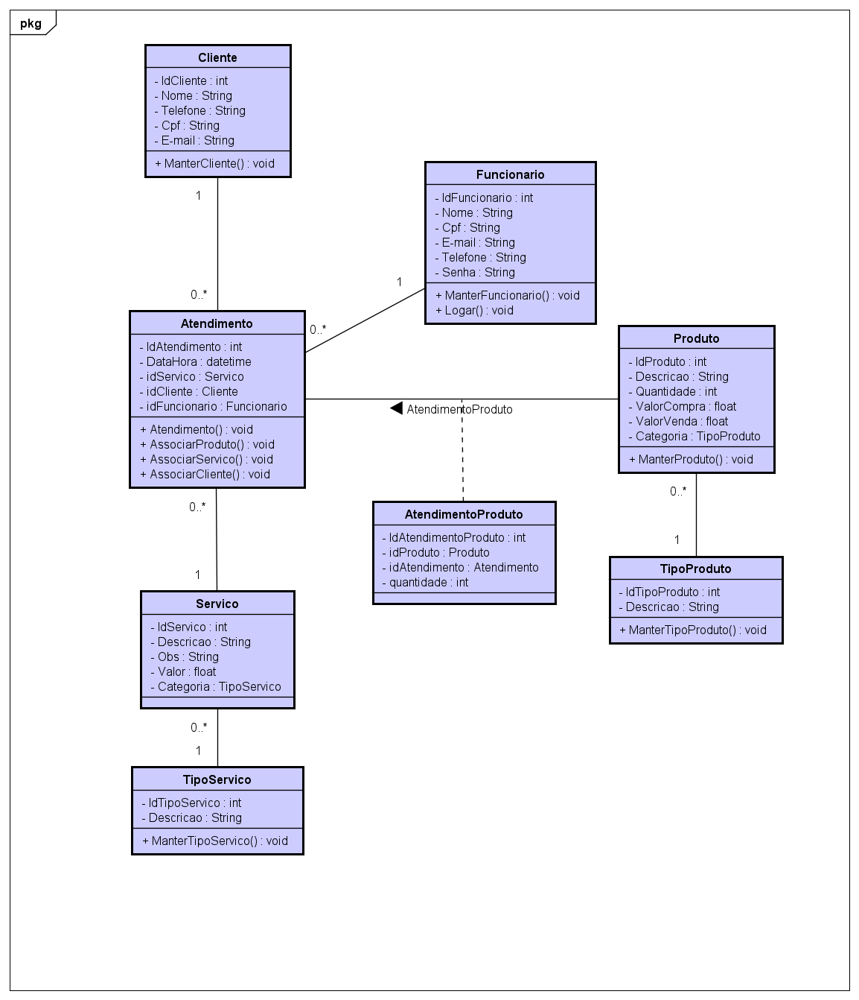

<h2>Nome: Gustavo Pandolpho</h2>
<h4>Matricula: 182740</h4> 

<h6>Projeto:<h6>

O projeto consiste em desenvolver uma aplicação para gerenciar atendimentos de barbearias,
as tecnologias utilizadas são, para o front-end, React e para o back-end, NodeJs.

Link para acesso dos documentos no Google Drive, acesso permitido apenas para professores.
https://drive.google.com/drive/folders/1igDrisXqdw_wPqUN851LFQ7ibdIGZKX7?usp=sharing

