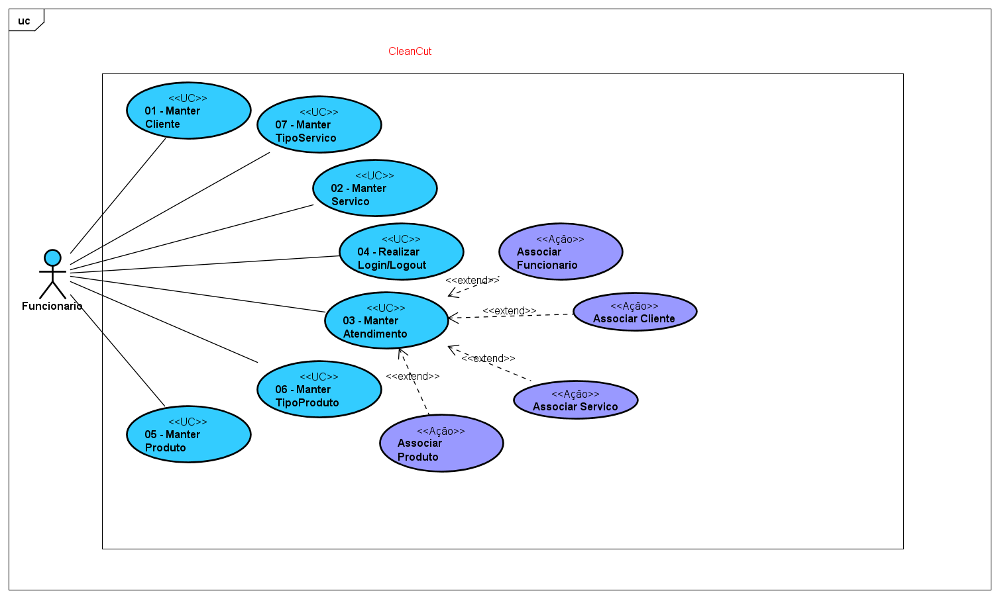
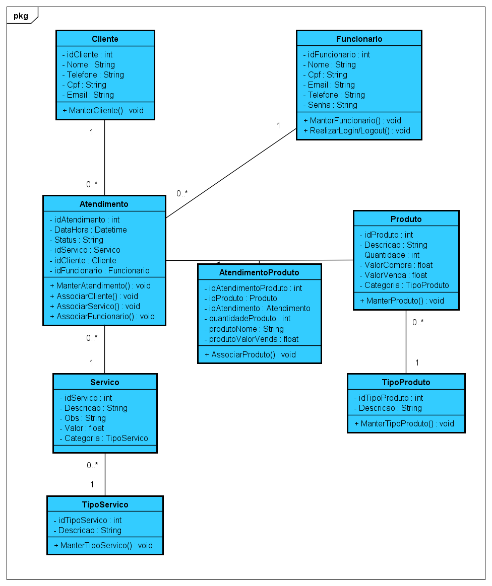

# Nome: Gustavo Pandolpho

## Matricula: 182740

### Projeto:

O projeto consiste em desenvolver uma aplicação para gerenciar atendimentos de barbearias,
as tecnologias utilizadas são, para o front-end, React e para o back-end, NodeJs.

Link para acesso dos documentos no Google Drive, acesso permitido apenas para professores.
https://drive.google.com/drive/folders/1igDrisXqdw_wPqUN851LFQ7ibdIGZKX7?usp=sharing

### Casos de Uso

### Diagrama de Classe

